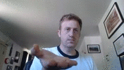
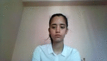
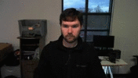
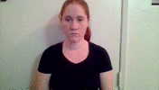
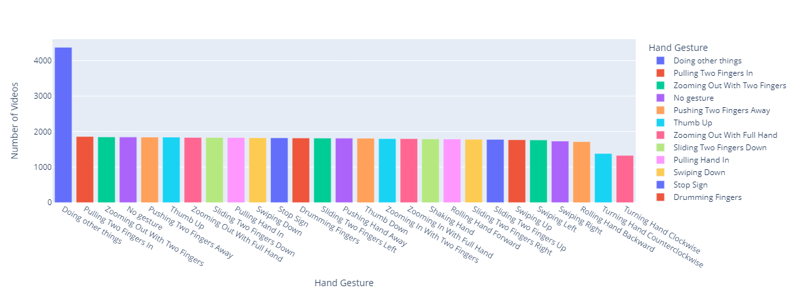
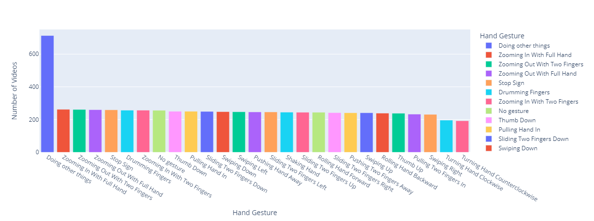

<div align="center">
  <h2 align="center">Hand Gesture Recognition for Contactless Human-Computer Interaction</h2>
  <p align="center">
    
    
    
    <br>
    Building a hand gesture recognition model and using it to identify hand gestures in real-time to trigger actions on a computer
  </p>
</div>

<details open="open">
  <summary><h3 style="display: inline-block">Table of Contents</h3></summary>
  <ol>
    <li>
      <a href="#about-the-project">About the Project</a>
      <ul>
        <li>
          <a href="#built-with">Built with</a>
        </li>
        <li>
          <a href="#dataset">Dataset</a>
        </li>
        <li>
          <a href="#example">Example Usage</a>
        </li>
        <li>
          <a href="#outline">Project Outline</a>
        </li>
      </ul>
    </li>
    <li>
      <a href="#prerequisites">Prerequisites</a>
    </li>
    <li>
      <a href="#setup">Setup</a>
    </li>
    <li>
      <a href="#acknowledgments">Acknowledgments</a>
    </li>
  </ol>
</details>

<h3 id="about-the-project">About the Project</h3>

<p>
  The COVID-19 pandemic has inevitably accelerated the adoption of a number of contactless Human-Computer Interaction (HCI) technologies, one of which is the hand gesture control technology. Hand gesture-controlled applications are widely used across various industries, including healthcare, food services, entertainment, smartphone and automotive.

  In this project, a hand gesture recognition model is trained to recognize static and dynamic hand gestures. The model is used to predict hand gestures in real-time through the webcam. Depending on the hand gestures predicted, the corresponding keystrokes (keyboard shortcuts) will be sent to trigger actions on a computer.
</p>

<h4 id="built-with">Built with</h4>

* [Keras](https://keras.io/)
* [OpenCV](https://opencv.org/)
* [Plotly](https://plotly.com/)
* [pynput](https://pynput.readthedocs.io/en/latest/)
* [keras-hypetune](https://github.com/cerlymarco/keras-hypetune)

<h4 id="dataset">Dataset</h4>

<p>
  The dataset used is a subset of the 20BN-Jester dataset from
  <a href="https://www.kaggle.com/datasets/toxicmender/20bn-jester">Kaggle</a>. It is a large collection of labelled video clips of humans performing hand gestures in front of a camera. 
  
  The full dataset consists of 27 classes of hand gestures in 148,092 video clips of 3 seconds length, which in total account for more than 5 million frames.

  In this project, 10 classes of hand gestures have been selected to train the hand gesture recognition model.
</p>

<h4 id="example">Example Usage</h4>

Any actions on a computer can be triggered as long as they are linked to a keyboard shortcut. For simplicity, this project is configured to trigger actions on YouTube because it has its own built-in keyboard shortcuts.

The table below shows the hand gestures and the actions they trigger on YouTube.

<div>
  <table>
    <tr>
      <th>Hand gesture</th>
      <th>Action</th>
    </tr>
    <tr>
      <td>Swiping Left
        <br></td>
      <td>Fast forward 10 seconds</td>
    </tr>
    <tr>
      <td>Swiping Right
      <br></td>
      <td>Rewind 10 seconds</td>
    </tr>
    <tr>
      <td>Swiping Down
      <br></td>
      <td>Previous video</td>
    </tr>
    <tr>
      <td>Swiping Up
      <br></td>
      <td>Next video</td>
    </tr>
    <tr>
      <td>Sliding Two Fingers Down
      <br></td>
      <td>Decrease volume</td>
    </tr>
    <tr>
      <td>Sliding Two Fingers Up
      <br></td>
      <td>Increase volume</td>
    </tr>
    <tr>
      <td>Thumb Down<br></td>
      <td>Mute / unmute</td>
    </tr>
    <tr>
      <td>Thumb Up<br></td>
      <td>Enter / exit full screen</td>
    </tr>
    <tr>
      <td>Stop Sign<br></td>
      <td>Play / Pause</td>
    </tr>
    <tr>
      <td>No Gesture<br></td>
      <td>No action</td>
    </tr>
  </table>
</div>

<h3 id="outline">Project Outline</h3>

<ol>
  <li>
    <b><a href="DataExploration&Extraction.ipynb">Data Exploration</a></b>
    <ul>
      <li>Explore class distribution of training and validation data.
      <br>Training data:
      <br>Validation data:</li>
    </ul>
  </li>
  <li>
    <b><a href="DataExploration&Extraction.ipynb">Data Extraction</a></b> 
    <ul>
      <li>Extract training and validation data of the selected classes from the dataset.</li>
    </ul>
  </li>
  <li>
    <b><a href="HyperparameterTuning.ipynb">Hyperparameter Tuning</a></b> 
    <ul>
      <li>Perform grid search to determine the optimal values for dropout and learning rate.</li>
    </ul>
  </li>
  <li>
    <b><a href="Training.ipynb">Model Training</a></b> 
    <ul>
      <!-- <li>Set parameters such as number of frames of each videos to be used, input shape of the frames, batch size and number of epochs.</li> -->
      <li>Build a 3D ResNet-101 model with the optimal hyperparameters.</li>
      <li>Compile the model.</li>
      <li>Train the model.</li>
    </ul>
  </li>
  <!-- <li>
    <b>Evaluation</b> 
    <ul>
      <li>Plot the model's accuracy and loss history graphs.</li>
      <li>Use the model to predict the classes of the testing samples.</li>
      <li>Plot a classification report.</li>
      <li>Plot a confusion matrix.</li>
    </ul>
  </li> -->
  <li>
    <b><a href="Classification.ipynb">Classification</a></b> 
    <ul>
      <li>Read frames from the webcam, predict the hand gestures in the frames using the model and send the corresponding keystrokes to trigger actions on the computer.</li>
    </ul>
  </li>
</ol>

<h3 id="prerequisites">Prerequisites</h3>

* Python 3.7.9 or above

<h3 id="setup">Setup</h3>

  ```sh
  pip install -r requirements.txt
  ```

<h3 id="acknowledgments">Acknowledgments</h3>

* [20bn-jester - Jester Dataset V1 for Hand Gesture Recognition _by toxicmender on Kaggle_](https://www.kaggle.com/datasets/toxicmender/20bn-jester)
* [The Jester Dataset: A Large-Scale Video Dataset of Human Gestures _by Joanna Materzynska, Guillaume Berger, Ingo Bax and Roland Memisevic_](https://openaccess.thecvf.com/content_ICCVW_2019/papers/HANDS/Materzynska_The_Jester_Dataset_A_Large-Scale_Video_Dataset_of_Human_Gestures_ICCVW_2019_paper.pdf)
* [Create Deep Learning Computer Vision Apps using Python 2020 _by Coding Cafe on Udemy_](https://www.udemy.com/course/create-deep-learning-computer-vision-apps-using-python-2020/)
* [3D ResNet implementation _by JihongJu_](https://github.com/JihongJu/keras-resnet3d/)
